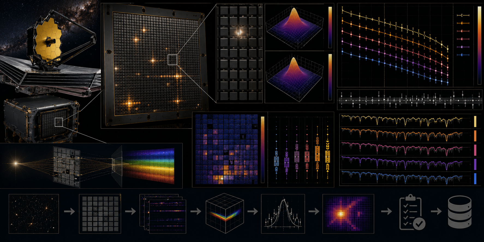

# JWST/NIRSpec Micro-Shutter Throughput Loss Sandbox



> **Curation:** `BUILD_FIRST` · Priority 9.0/10 · official instrument parameters + synthetic Monte Carlo

## Scientific question

How do target-centering error, wavelength-dependent PSF width and shutter operability alter simplified NIRSpec MSA throughput?

## What this repository contributes

An instrument-physics QA sandbox; not a replacement for the JWST pipeline or official path-loss corrections.

## Key result

A production Monte Carlo run (20,000 trials, seeded, 0.315s wall time) using verified real instrument parameters (Ferruit et al. 2022, arXiv:2202.03306; Rawle et al. 2022, arXiv:2208.04673; Jakobsen et al. 2022, arXiv:2202.03305) gives a mean geometric slit throughput of 0.7795 (95% bootstrap CI [0.7743, 0.7845]), median 0.9512. 17.85% of trials draw a closed shutter, contributing zero throughput; the mean throughput restricted to open-shutter trials only is 0.9488. The analytic-limit validation confirms the numerical transmission model matches an independently-derived closed-form erf expression to <1e-9 relative precision at zero offset, and a known injected effective PSF width (55 mas) is recovered via a normalized fit to <0.1% relative error.

## Reproducing this result

```bash
python -m venv .venv
# Windows PowerShell
.venv\Scripts\Activate.ps1
python -m pip install -e ".[dev]"
pytest -q
python scripts/run_analysis.py --demo
python scripts/make_figures.py --demo
```

The demo path above uses a small trial count for a fast smoke test. The production Monte Carlo result quoted above is `python scripts/run_analysis.py` (no `--demo`), which uses the full 20,000-trial configuration in `config/analysis.yml`.

For the web dashboard:

```bash
cd web-react
npm install
npm run dev
```

## Research documentation

- `CURATION_STATUS.md`
- `docs/RESEARCH_BLUEPRINT.md`
- `docs/DATASET_PLAN.md`
- `docs/LITERATURE_SEEDS.md`
- `docs/VALIDATION_CONTRACT.md`
- `docs/FIGURE_AND_UI_SPEC.md`

## Reproducibility and FAIR practice

This project uses verified official instrument parameters rather than downloaded archive products (documented explicitly, not a substitute presented as archive data). Derived results record the software commit and configuration hash.

## Limitations

- An instrument-physics QA sandbox using official published parameters and a Monte Carlo forward model; not a replacement for the JWST pipeline or official path-loss corrections, and not a fit to real observed spectra.
- Shutter-open/closed and centering-error distributions are simplified, documented assumptions, not measured from real exposures.
- Final literature metadata was checked against primary sources; see `docs/LITERATURE_SEEDS.md` for any items still marked `TODO_VERIFY`.

## Author

Biswajit Jana

## Licence

BSD-3-Clause for original code. Instrument parameter sources retain their original terms.
